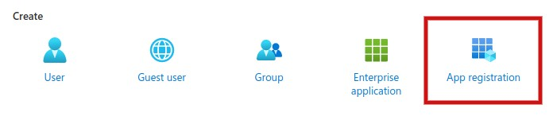
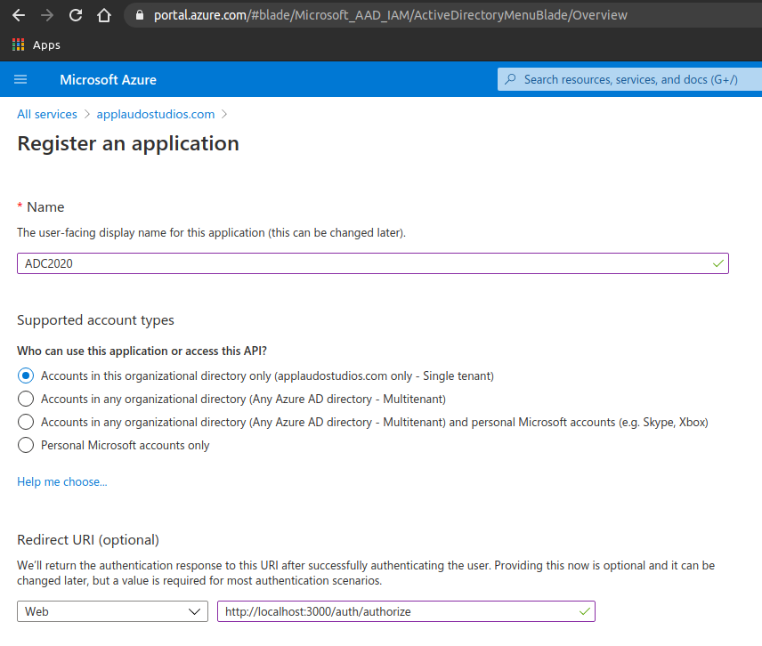
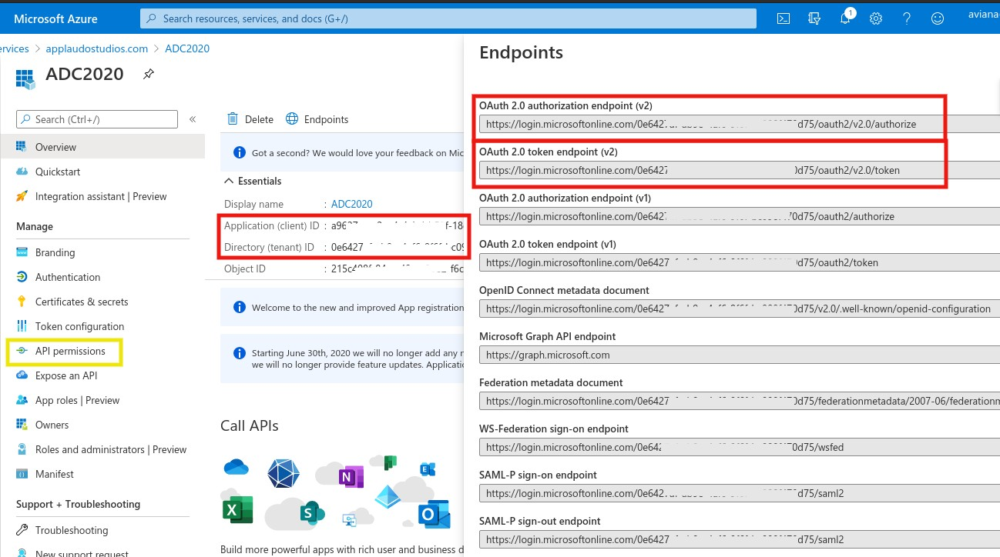
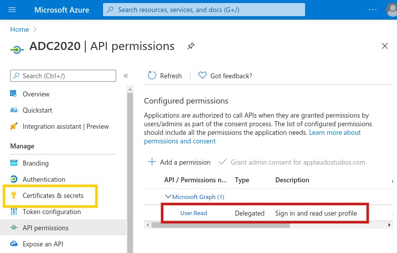
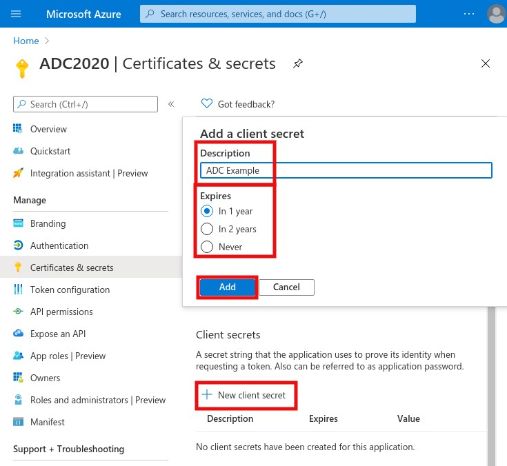
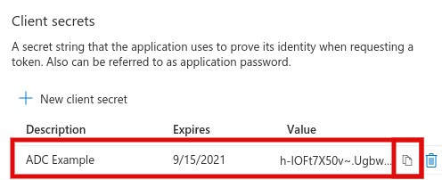

# Set up our Authorization Server

## Requirements:
* Outlook account

## Steps
1. Sign in with your outlook account
2. Go to [Azure Portal](https://portal.azure.com/)
3. Clic on **Azure Active Directory** 
4. Create an App Registration 
5. Register an application: Add Name, target audiences and the redirec URI(`AZURE_REDIRECT_URL`) 
6. Get your credentials(`AZURE_CLIENT_ID`, `AZURE_TENANT_ID`) and look the available endpoints. Then clic on `API permissions` 
7. Set the API scope(`AZURE_SCOPE`). By default the `User.Read` permission is created and it's enought for this example. 
8. Create a `New client secret` 
9. Copy the secret to your `AZURE_CLIENT_SECRET` ENV variable 